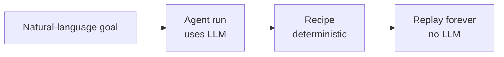

AI automation is the fastest way to go from *"I need to do this thing on a site"*
to a working, reusable recipe. You describe the goal; the agent inspects the page
and does it.

## When to use it

<CardGroup cols={2}>
  <Card title="Great for" icon="circle-check">
    Exploring an unfamiliar site, one-off extractions, bootstrapping a recipe you'll
    then refine, or flows where the layout varies run to run.
  </Card>
  <Card title="Reach for recording instead when" icon="circle-dot">
    You already know the exact flow, it's behind a login, or you want to create the
    recipe without spending any tokens. See [Recording](/guides/recording).
  </Card>
</CardGroup>

## Writing a good goal

The goal is a natural-language instruction. The more concrete the data, the
better the result.

<CodeGroup>
```text Good — specific data, one clear outcome
Fill out the contact form with name "Ada Lovelace", email "ada@example.com",
subject "Billing question", and message "Please call me back." Then submit it
and confirm you reached a thank-you page.
```
```text Vague — the agent has to guess
Fill out the form.
```
</CodeGroup>

<Tip>
End your goal with the **success condition** ("confirm you reached a thank-you
page"). The agent uses it to decide when it's actually done, which produces a
cleaner recipe and a more reliable `assert` if you save it.
</Tip>

## Running a task

<Steps>
  <Step title="Open New Task">
    Enter the goal and a starting URL. Optionally expand **Botasaurus
    configuration** to set headless, markdown output, stealth options, etc.
  </Step>
  <Step title="Watch the timeline">
    The run streams in live. The first navigation is deterministic; subsequent
    actions are the agent's decisions. Expand an LLM call to see its reasoning.
  </Step>
  <Step title="Review the result">
    On success you get a summary, any extracted content, and token totals. On
    failure, the timeline shows exactly which step and selector failed.
  </Step>
</Steps>

Or start one via the API:

```bash
curl -X POST localhost:8000/api/runs \
  -H "Content-Type: application/json" \
  -d '{
    "goal": "Extract the main article on this page as markdown.",
    "start_url": "https://example.com/blog/post",
    "botasaurus_config": { "headless": true, "output_format": "markdown" }
  }'
# → { "run_id": 42 }
```

## What the agent can do

The model chooses from a fixed set of tools each turn:

| Tool | Effect |
| --- | --- |
| `navigate` | Go to a URL |
| `click` | Click an element |
| `type` | Type into a field |
| `fill_form` | Set **many** fields in one batch (cheaper than many `type`s) |
| `select_option` | Choose a dropdown option |
| `scroll` | Scroll to load or reveal content |
| `wait_for` | Wait for an element to appear |
| `extract_markdown` / `extract_text` | Capture content **locally** (no model round-trip) |
| `run_js` | Run JavaScript as a last resort |
| `finish` | End the task with a success flag and summary |

<Note>
`extract_markdown` and `extract_text` are deliberately *not* "read the page back
to the model." They run in pure Python and store the result — the agent never
pays tokens to look at content it asked for.
</Note>

## Turning a run into a recipe

This is the payoff. When an agent run succeeds, click **Save as recipe**:

- The recorded actions become deterministic steps.
- The data you put in your goal is auto-detected and turned into `{{variables}}`.
- The recipe replays with **no AI** from then on.



<Warning>
The agent fills forms with the data **you provide in the goal** (or placeholder
data). Only automate sites you're authorized to use, and double-check what a
recipe submits before you schedule it to run unattended.
</Warning>

## Tuning cost and behavior

- **Pick a cheaper model** in Settings for simple, well-structured sites; reserve
  a stronger model for messy ones.
- **Block images** (`block_images: true`) to speed up navigation when you don't
  need to see them.
- **Prefer `extract_markdown`** in your goal when you just want content — it
  short-circuits the LLM entirely.
