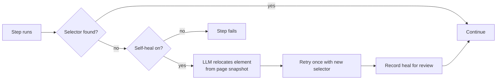

A recipe that worked last week can break when a site ships a redesign. Self-healing
is the safety net: when a step's selector — and all its fallbacks — fail during a
replay, the studio asks the LLM to find the element on the current page, retries
once, and records the repair for you to review.

<Note>
Replay is normally **100% AI-free**. Self-healing only calls the model on an actual
selector break, and only if you've enabled it and configured an API key. A recipe
that never breaks never spends a token.
</Note>

## How it works



The healing attempt is deliberately bounded so it can never loop or run away:

<CardGroup cols={3}>
  <Card title="One retry per step" icon="1">
    The relocated selector is tried exactly once. The retry itself is never re-healed.
  </Card>
  <Card title="Capped per run" icon="gauge">
    A whole run can only heal a small, fixed number of times before it gives up.
  </Card>
  <Card title="Selector breaks only" icon="filter">
    Healing fires on a *missing element*, never on a legitimately failing assertion
    like `text_contains`.
  </Card>
</CardGroup>

## Enabling it

On a recipe's page, tick **Self-healing** and choose a mode:

<Tabs>
  <Tab title="Propose (default)">
    The recipe is left untouched. Each heal is recorded and flagged for you to
    **Accept** (which patches the new selector in and bumps the recipe version) or
    **Reject**. Best when you want a human in the loop.
  </Tab>
  <Tab title="Auto-apply">
    The recipe is patched immediately and its version bumped — but the heal is
    still recorded for audit, so you can review or revert it. Best for unattended,
    scheduled routines that must keep running.
  </Tab>
</Tabs>

<Tip>
For a recipe you run on a cron schedule overnight, **Auto-apply** keeps it alive
through small site tweaks. For something high-stakes, **Propose** lets you sign
off on every change.
</Tip>

## Reviewing heals

Healed steps appear in the **Healed steps** table on the recipe page and as a
distinct `healed` badge in the run timeline — so the sequence *failed → AI
relocate → successful retry* is fully visible. Accept or reject from the UI or the
API:

```bash
# list proposed/applied heals for a recipe
curl localhost:8000/api/recipes/1/heals

# accept a heal (patches the selector into the recipe, bumps its version)
curl -X POST localhost:8000/api/recipes/1/heals/7/accept

# or reject it (leaves the recipe unchanged)
curl -X POST localhost:8000/api/recipes/1/heals/7/reject
```

## On the command line

The CLI runner can heal too — and degrades gracefully when no key is available, so
a cron job never crashes just because healing couldn't run:

```bash
python -m backend.runner --recipe-id 1 --self-heal
# "self-healing enabled"        → key found, healing active
# "warning: no API key ... continuing without healing" → runs AI-free instead
```

## Best practices

<AccordionGroup>
  <Accordion title="Lean on fallbacks first" icon="layer-group">
    Self-healing is the last line of defense. Recorded recipes already carry
    `selector_fallbacks`, which are tried with zero AI before any heal. Keep those
    — they catch most minor changes for free.
  </Accordion>
  <Accordion title="Record good healing hints" icon="kit-medical">
    Heals work best when the step has an `element_label`/`element_text` to match on.
    The extension and agent record these automatically; if you hand-write a recipe,
    adding them improves healing accuracy.
  </Accordion>
  <Accordion title="Review auto-applied heals periodically" icon="clipboard-check">
    Auto mode keeps you running, but glance at the heals table now and then — a
    repair that "worked" might have clicked a subtly wrong element.
  </Accordion>
</AccordionGroup>
